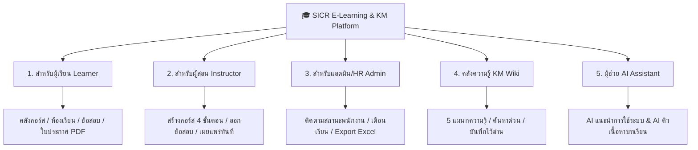

# 🎓 คู่มือสรุปฟังก์ชันการทำงานทั้งระบบ (System Feature Overview)
## 📘 SICR E-LEARNING & Knowledge Management Platform
> **สำหรับ:** ผู้บริหาร, ฝ่ายบุคคล (HR), ผู้สอน และพนักงานทั่วไป (Non-Developer Friendly)  
> **บริษัท:** บริษัท ซอฟต์ อินเตอร์ เชียงราย จำกัด (Soft Inter Chiangrai Co., Ltd.)  
> **เวอร์ชันเอกสาร:** 1.0.0 (ฉบับสมบูรณ์)

---

## 🌟 ภาพรวมระบบ (System Overview)

แพลตฟอร์ม **SICR E-LEARNING & KM Platform** เป็น **"ศูนย์กลางการเรียนรู้และคลังความรู้องค์กรแบบครบวงจร"** ที่ออกแบบมาเพื่อยกระดับทักษะของพนักงานและรวบรวมองค์ความรู้ภายในบริษัท Soft Inter Chiangrai ไว้ในที่เดียว โดยแบ่งออกเป็น 2 ระบบหลัก:

1. **ระบบเรียนออนไลน์ (E-Learning / LMS):** ค้นหาคอร์ส, เข้าเรียนออนไลน์, ทำแบบทดสอบท้ายบท และรับใบประกาศนียบัตรดิจิทัล
2. **ระบบคลังความรู้องค์กร (Knowledge Management / KM):** รวบรวมคู่มือการทำงาน, แนวทางปฏิบัติงาน, สวัสดิการพนักงาน และเอกสารสำคัญของแต่ละแผนก

---

## 1. 🎒 สำหรับพนักงาน / ผู้เรียน (Learner Experience)
*ออกแบบมาเพื่อให้พนักงานสามารถเรียนรู้ได้ด้วยตนเองอย่างต่อเนื่องและเห็นพัฒนาการชัดเจน*

### 🔎 1.1 แคตตาล็อกค้นหาคอร์สเรียน (Course Catalog & Multi-Filter)
- **ตัวกรองหมวดหมู่แบบชิป:** เลือกกรองตามสายงานได้ทันที เช่น Frontend, Backend, AI & Data, QA Testing, DevOps & Cloud, หรือคอร์สปฐมนิเทศพนักงานใหม่
- **ระดับความยากง่าย (Level Badge):** มีป้ายระบุชัดเจน (ระดับเริ่มต้น Beginner, ปานกลาง Intermediate, ระดับสูง Advanced)
- **คอร์สบังคับประจำปี (Mandatory Tag):** แสดงป้ายเตือนคอร์สที่พนักงานทุกคนต้องเรียนให้จบตามนโยบายบริษัท
- **สถิติคอร์ส:** แสดงระยะเวลาเรียน, แต้มพลัง XP ที่จะได้รับ, จำนวนผู้เรียน และคะแนนดาวรีวิว (1-5 ดาว)
- **สลับมุมมอง:** เลือกดูแบบตารางการ์ด (Grid View) หรือแบบรายการยาว (List View) ได้ตามสะดวก

### 🎥 1.2 ห้องเรียนออนไลน์อัจฉริยะ (Classroom Player)
- **เครื่องเล่นวิดีโอระดับ HD:** รองรับวิดีโอบทเรียนคมชัด ควบคุมความเร็วและเสียงได้สะดวก
- **แถบสารบัญบทเรียน (Playlist Accordion):** แสดงหัวข้อและบทเรียนย่อยทั้งหมด พร้อมเครื่องหมายถูก (`✓`) เมื่อเรียนจบแต่ละบท
- **คำนวณความคืบหน้าอัตโนมัติ (% Progress Bar):** บันทึกสถานะการเรียนแบบเรียลไทม์ เรียนค้างไว้ที่ไหนสามารถกลับมาเรียนต่อได้ทันที
- **ระบบจดบันทึกส่วนตัว (Personal Notes):** ช่องจดบันทึกช่วยจำระหว่างฟังบรรยาย
- **ดาวน์โหลดเอกสารประกอบ (Course Resources):** ดาวน์โหลดไฟล์สไลด์, PDF, หรือลิงก์ที่ผู้สอนเตรียมไว้ให้

### 📝 1.3 ระบบทำข้อสอบและประเมินผล (Quiz & Assessment Engine)
- **รูปแบบข้อสอบที่หลากหลาย:** รองรับทั้งแบบตัวเลือก (Single / Multiple Choice), ข้อสอบถูก-ผิด (True/False) และข้อสอบวิเคราะห์โค้ด
- **ระบบจับเวลาสอบ (Countdown Timer):** แสดงเวลาที่เหลือก่อนส่งข้อสอบ
- **ตรวจคะแนนอัตโนมัติ (Instant Auto-Grading):** ตรวจผลทันทีหลังส่ง กำหนดเกณฑ์ผ่านที่ **80%**
- **โหมดเฉลยละเอียด (Detailed Review Mode):** แสดงคำตอบที่ถูกต้องเปรียบเทียบกับคำตอบที่เลือก พร้อมกล่องคำอธิบายเฉลยเชิงลึก

### 🏆 1.4 ใบประกาศนียบัตรดิจิทัล (Digital Certificate Generator)
- **ออกใบประกาศให้อัตโนมัติ:** เมื่อเรียนจบครบ 100% และสอบผ่านเกณฑ์ ระบบจะสร้างใบประกาศนียบัตรระดับพรีเมียมให้ทันที
- **มาตรฐานความปลอดภัย:** มีรหัสใบรับรองเฉพาะบุคคล (`SICR-CERT-YYYY-XXXXX`) และ QR Code สำหรับสแกนตรวจสอบความถูกต้อง
- **สั่งพิมพ์ / บันทึกเป็น PDF:** ปุ่มสั่งพิมพ์ด้วยดีไซน์จัดหน้ากระดาษ A4 แนวนอนอัตโนมัติ เหมาะสำหรับแนบยื่นประเมินผลงาน

### 🔥 1.5 แดชบอร์ดติดตามเป้าหมาย (My Learning & Gamification)
- **สถิติการเรียนต่อเนื่อง (Active Streak):** แสดงจำนวนวันที่เข้าเรียนต่อเนื่องในสัปดาห์ (จันทร์ - อาทิตย์)
- **เป้าหมายเวลาเรียนรายวัน (Daily Goal Tracker):** แถบสะสมเวลาเรียน เช่น 35/45 นาที
- **แต้มสะสมพลังการเรียนรู้ (XP Points):** สะสมแต้มจากการเรียนและทำข้อสอบ
- **ตารางอันดับผู้นำ (XP Leaderboard):** แสดงรายชื่อ Top 5 พนักงานที่มีแต้มการเรียนรู้สูงสุดประจำเดือน

---

## 2. 👨‍🏫 สำหรับอาจารย์ / ผู้สอน (Instructor Studio)
*สตูดิโอสร้างหลักสูตรที่ใช้งานง่าย ไม่จำเป็นต้องมีความรู้ด้านไอทีหรือเขียนโปรแกรม*

### 🚀 2.1 ระบบสร้างคอร์สอบรม 4 ขั้นตอน (Course Builder Stepper)
- **Step 1 (ข้อมูลทั่วไป):** กรอกชื่อคอร์ส, หมวดหมู่, ระดับความยาก, แต้ม XP, คำอธิบาย และเลือกรูปภาพหน้าปกสวยงามจาก Preset Gallery
- **Step 2 (จัดโครงสร้างบทเรียน):** เพิ่มบทเรียนและโมดูลได้ไม่จำกัด รองรับทั้งบทเรียนวิดีโอ (YouTube/MP4) และบทเรียนเอกสาร (Article Markdown)
- **Step 3 (ออกข้อสอบท้ายบท):** ตั้งคำถาม, ช้อยส์คำตอบ, ระบุตัวเลือกที่ถูกต้อง และเขียนคำอธิบายเฉลย
- **Step 4 (ตรวจทาน & เผยแพร่):** ดูการ์ดตัวอย่างเสมือนจริง (Live Card Preview) และกด **"🚀 เผยแพร่หลักสูตรทันที"** เพื่อให้พนักงานเริ่มเรียนได้เลย

### 📊 2.2 จัดการและติดตามคอร์สที่สอน (Course Governance)
- ตรวจสอบสถานะหลักสูตร: ฉบับร่าง (Draft), รออนุมัติ (Pending), เผยแพร่แล้ว (Published) และจัดเก็บเข้าคลัง (Archived)
- ดูจำนวนผู้ลงทะเบียนเรียน และคะแนนรีวิวจากเพื่อนร่วมงาน

---

## 3. 🛡️ สำหรับผู้ดูแลระบบ / ฝ่ายบุคคล (Admin & HR Governance)
*เครื่องมือสำหรับฝ่ายบริหารและ HR ในการกำกับดูแลการฝึกอบรมของพนักงานทั้งองค์กร*

### 📈 3.1 แดชบอร์ดสถิติภาพรวมองค์กร (Analytics KPI Metrics)
- สรุปจำนวนพนักงานที่กำลังเรียนรู้ (Active Learners)
- อัตราการเรียนจบเฉลี่ยของทั้งบริษัท (Overall Completion Rate %)
- อัตราการผ่านเกณฑ์คอร์สบังคับ (Mandatory Compliance Rate %)
- จำนวนชั่วโมงการเรียนรู้รวม และแต้ม XP ที่แจกจ่าย

### 🚦 3.2 ตารางติดตามการอบรมตามเกณฑ์บังคับ (Department Compliance Matrix)
- ตรวจสอบสถานะการเรียนรายแผนกด้วย **ระบบสีไฟจราจร (Traffic Light System)**:
  - 🟢 **สีเขียว:** ผ่านเกณฑ์ 100%
  - 🟡 **สีเหลือง:** อยู่ระหว่างการเรียนรู้
  - 🔴 **สีแดง:** ยังไม่เริ่มเรียนหรือค้างบทเรียน
- ตรวจสอบรายชื่อพนักงานเป็นรายบุคคล พร้อมปุ่มคลิกเดียวเพื่อ **ส่งข้อความแจ้งเตือนผ่าน Slack / Email**

### 📥 3.3 ดาวน์โหลดรายงานสรุป (Export Compliance CSV / Excel)
- ปุ่มดาวน์โหลดรายงานข้อมูลสรุปผลการเรียนของพนักงานทุกคนออกมาเป็นไฟล์ CSV (UTF-8 BOM) รองรับการเปิดใน Microsoft Excel และ Google Sheets นำไปทำรายงานเสนอผู้บริหารได้ทันที

---

## 4. 💡 คลังความรู้องค์กร (Knowledge Management - KM Base)
*ศูนย์รวมเอกสารและคู่มือการทำงานภายใน แก้ปัญหาความรู้กระจัดกระจาย*

### 🏢 4.1 จัดหมวดหมู่ตาม 5 แผนกหลัก (Department Spaces)
1. 💻 **Software Engineering (ฝ่ายพัฒนาซอฟต์แวร์):** มาตรฐานการเขียนโค้ด (Coding Conventions), สถาปัตยกรรม Signals, คู่มือการใช้งาน Git Flow และ REST API Standards
2. 🧪 **QA & Automated Testing (ฝ่ายทดสอบระบบ):** คู่มือการเขียน Automated Test ด้วย Playwright, ตารางประเมินระดับความรุนแรงของ Bug (Severity Matrix)
3. 🤝 **People & Culture (ฝ่ายบริหารงานบุคคล):** คู่มือสวัสดิการพนักงาน, นโยบายวันลาพักร้อน และขั้นตอนการเบิกงบพัฒนาทักษะ (Learning Budget) 20,000 บาท/ปี
4. 📈 **Solutions & Business Development (ฝ่ายพัฒนาธุรกิจ):** รูปแบบเอกสาร Proposal, แนวทางการนำเสนองานลูกค้า และ Pitch Deck Template
5. 🛠️ **DevOps & IT Infrastructure (ฝ่ายโครงสร้างพื้นฐาน):** คู่มือการเชื่อมต่อ VPN WireGuard, การเข้าถึง Server อย่างปลอดภัย (Zero-Trust Security)

### ⚡ 4.2 ค้นหาคำสำคัญความเร็วสูง (Instant Multi-Field Search)
- กล่องค้นหาอัจฉริยะ พิมพ์คำค้นหาปุ๊บ ระบบจะค้นหาจากทั้ง **หัวข้อ, เนื้อหาในบทความ, แท็กคำสำคัญ, ชื่อผู้เขียน และโค้ดตัวอย่าง** ให้ทันที

### 📑 4.3 ระบบอ่านบทความที่ทันสมัย (Rich Article Reader)
- **กล่องเน้นข้อความหลากสี:** กล่องแจ้งเตือน (`Note`), กล่องเคล็ดลับ (`Tip`), กล่องคำเตือน (`Warning`), กล่องข้อควรระวัง (`Important`)
- **กล่องแสดงโค้ด (Interactive Code Viewer):** ไฮไลต์สี Syntax สวยงาม พร้อมปุ่มคลิกเดียว `📋 คัดลอกโค้ด`
- **ประวัติการแก้ไขเอกสาร (Version History Timeline):** แสดงเวอร์ชันเอกสาร ผู้แก้ไขล่าสุด และบันทึกการเปลี่ยนแปลง
- **ปุ่มประเมินความพึงพอใจ:** โหวตให้คะแนน "บทความนี้มีประโยชน์หรือไม่? 👍 / 👎"
- **ปุ่มบันทึกรายการโปรด (Bookmark) และกดถูกใจ (Like):** บันทึกบทความไว้อ่านภายหลัง

---

## 5. 🤖 ผู้ช่วย AI อัจฉริยะ (SICR AI Knowledge Assistant)
*ผู้ช่วย AI ประจำการที่มุมขวาล่างของหน้าจอ พร้อมตอบคำถามพนักงานตลอด 24 ชั่วโมง*

### 🧭 โหมดที่ 1: AI แนะนำการใช้งานระบบ (System Guide)
- **วัตถุประสงค์:** ช่วยเหลือการใช้งานเว็บไซต์ นำทางไปยังเมนูต่างๆ และอธิบายวิธีใช้งานระบบ
- **ตัวอย่างคำถาม:** *"ขอใบประกาศนียบัตร PDF ตรงไหน?", "วิธีสร้างคอร์สใหม่ทำยังไง?", "สลับสิทธิ์ผู้สอน/แอดมินตรงไหน?", "ดูรายงานสถิติพนักงานที่ไหน?"*
- **ปุ่มทางลัด (Action Buttons):** แนบปุ่มลิงก์ให้คลิกนำทางไปยังหน้าปลายทางได้ทันทีใน 1 คลิก

### 🎓 โหมดที่ 2: AI ติวเตอร์และองค์ความรู้ (Learning & KM Tutor)
- **วัตถุประสงค์:** ตอบข้อสงสัยเชิงวิชาการ อธิบายเนื้อหาบทเรียน และค้นคว้าข้อมูลจากคลังความรู้ KM
- **ตัวอย่างคำถาม:** *"สรุปจุดเด่นของ Angular 22 ให้หน่อย", "งบ Learning Budget 20,000 บาท เบิกยังไง?", "วิธีตั้งค่า VPN WireGuard บริษัท", "Playwright มี Best Practices อะไรบ้าง?"*
- **แสดงโค้ดและแหล่งอ้างอิง:** แสดงกล่องโค้ดตัวอย่างพร้อมปุ่มคัดลอก และแสดงป้ายลิงก์อ้างอิง (Source Citations) ไปยังบทความหรือคอร์สต้นทาง

---

## 6. ✨ ประสบการณ์การใช้งานระดับพรีเมียม (User Experience & UI)

- **🎭 ตัวสลับบทบาทจำลอง (Dynamic Role Switcher):** ปุ่มที่แถบ Header สลับมุมมองระหว่าง **ผู้เรียน (Learner)**, **ผู้สอน (Instructor)** และ **ผู้ดูแลระบบ (Admin)** ได้ทันที เพื่อทดสอบการทำงานโดยไม่ต้องสลับบัญชีผู้ใช้
- **🌙 / ☀️ สลับโหมดมืด-สว่าง (Dark / Light Theme):** รองรับการใช้งานสบายตา ปรับเปลี่ยนพาเลตต์สีและคอนทราสต์ทั้งระบบอย่างลงตัว
- **📱 รองรับทุกขนาดหน้าจอ (100% Responsive Design):** ใช้งานได้สมบูรณ์แบบทั้งบนหน้าจอใหญ่ (1920x1200), จอคอมพิวเตอร์ทั่วไป, แท็บเล็ต iPad และโทรศัพท์มือถือสมาร์ทโฟน
- **📖 คู่มือการใช้งานระบบในตัว (In-App Interactive User Guide):** เปิดอ่านคู่มือสรุปวิธีใช้งานระบบได้ตลอดเวลาจากปุ่ม `❓ คู่มือ` บนแถบเมนูด้านบนหรือท้ายหน้าเว็บ
