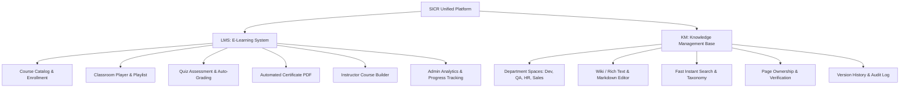

# 📘 SICR E-Learning & Knowledge Management System
## 📑 Complete Project Handoff & Technical Specification
> **องค์กร:** Soft Inter Chiangrai Co., Ltd. ([www.softinterchiangrai.com](https://www.softinterchiangrai.com))  
> **เทคโนโลยี Frontend:** Angular 22 + `@sic-ng` Component Framework (`projects/sic-ng`)  
> **เป้าหมาย:** ระบบ E-Learning (LMS) และ Knowledge Management (KM) แบบรวมศูนย์สำหรับพนักงาน, ผู้สอน, และแอดมิน  
> **เวอร์ชันเอกสาร:** 1.0.0 (บันทึกข้อมูลครบถ้วนสำหรับอ่านและเริ่มพัฒนาได้ทันที)

---

## 1. 📌 สรุปภาพรวมและวัตถุประสงค์ (Executive Summary)

**SICR E-Learning & KM Platform** เป็นแพลตฟอร์มการเรียนรู้และจัดการคลังความรู้สำหรับองค์กร พัฒนาขึ้นเพื่อแก้ปัญหาการกระจายตัวขององค์ความรู้และการฝึกอบรม โดยรวม 2 โมดูลหลักไว้ภายใต้ Identity & Design System เดียวกัน:

1. **LMS (Learning Management System):** การเรียนการสอน, หลักสูตร Onboarding, ติดตามความคืบหน้า (Progress), ทำข้อสอบ (Assessment) และออกใบประกาศนียบัตร (Certificate)
2. **KM (Knowledge Management):** คลังเอกสาร Wiki ภายในองค์กร แยกตามฝ่าย/แผนก (Spaces), มีระบบค้นหาที่รวดเร็ว (Instant Search), มีเจ้าของบทความ (Page Owner) และเก็บประวัติการแก้ไข (Version History)



---

## 2. 🎨 Brand Identity & Design System Guide

อ้างอิงจากอัตลักษณ์ของ **Soft Inter Chiangrai** และคอมโพเนนต์ในไลบรารี [sic-ng](file:///c:/Project/sicr-framework-ng/projects/sic-ng):

### 2.1 โทนสีหลัก (Color Palette)
- **Primary Brand Color:** `#00a887` / `#009688` (Teal Emerald Green - สื่อถึงความทันสมัย ปลอดภัย และความเชี่ยวชาญด้าน IT)
- **Secondary / Accent:** `#10b981` / `#34d399` (Vibrant Leaf Green - ใช้กับ Progress Bar, สถานะ Passed, Badges)
- **Dark Neutral (Slate):** `#0f172a` / `#1e293b` (ใช้กับ Navbar, Sidebar Dark Mode, Heading Typography)
- **Light Surface:** `#f8fafc` / `#ffffff` (พื้นหลังหน้าจอ, การ์ดคอนเทนต์)
- **Border / Outline:** `#e2e8f0` (โหมดสว่าง) / `#334155` (โหมดมืด)
- **Status Colors:**
  - Success: `#10b981` (Completed / ผ่านการทดสอบ)
  - Warning: `#f59e0b` (In Progress / ใกล้หมดเวลา)
  - Danger / Error: `#ef4444` (Failed / ตกหล่น)
  - Info: `#0ea5e9` (Announcements / บทเรียนใหม่)

### 2.2 Typography
- **Headings & Display:** `Inter`, `Prompt`, `Kanit` (Sans-Serif สไตล์ Modern Clean)
- **Body Text:** `Inter`, `Prompt`, `system-ui`
- **Code Snippets:** `Fira Code`, `JetBrains Mono`, `Consolas`

---

## 3. 🎯 แผนการพัฒนาแบ่งเฟส (Phase Breakdown Roadmap)

```mermaid
timeline
    title แผนงานการพัฒนาและส่งมอบ SICR E-Learning & KM
    section Phase 1 : MVP (Core Essential)
      LMS Core : User/Role Management (Learner, Instructor, Admin)
               : Course Builder & Multi-format Lessons (Video, PDF, Docs)
               : Enrollment & Progress Tracking (% Real-time)
               : Quiz & Assessment with Auto-grading
               : Automated Certificate Generation (PDF Download)
               : Basic Admin Reporting & Completion Matrix
      KM Core  : Department Spaces (Dev, QA, HR, Sales, Support)
               : Wiki Rich/Markdown Editor with Internal Links
               : High-Speed Instant Keyword Search
               : Page Ownership & Review Date
               : Version History & Changelog
               : Mobile & Tablet Web Responsive
    section Phase 2 : Enterprise & Intelligence
      Advanced LMS : SCORM 1.2 / 2004 & xAPI Package Support
                   : Role-based Adaptive Learning Paths
                   : Gamification (Badges, XP Points, Streaks, Leaderboards)
                   : Virtual Live Sessions (vILT / Zoom / Teams)
                   : Manager-Led Cohorts & Practical Assignment Review
      Advanced KM  : GenAI Course Generation & Multilingual Auto-translation
                   : Semantic Vector Search & AI Q&A Assistant Bot
                   : Passive Knowledge Capture (Tickets, Slack, Teams)
                   : Deep Skill Matrix & Multi-Tenant Organization Structure
```

---

### 3.1 🌟 Phase 1: MVP (สิ่งที่ต้องทำเป็นอันดับแรก & Frontend Mockup Scope)

#### LMS (Learning Management System)
1. **User & Role Management**:
   - **Learner (ผู้เรียน):** ดูรายการคอร์ส, กดลงทะเบียน (Enroll), ติดตามความคืบหน้า, ทำแบบทดสอบ, ดาวน์โหลดใบ Certificate
   - **Instructor (ผู้สอน):** สร้างโครงสร้างหลักสูตร, จัดการบทเรียน (วิดีโอ, สไลด์, เอกสารประกอบ), ออกข้อสอบ
   - **Admin (ผู้ดูแลระบบ):** จัดการสิทธิ์ผู้ใช้งาน, กำหนดคอร์สบังคับ (Mandatory Courses), ดูรายงานภาพรวม
2. **Course Builder & Classroom Player**:
   - ระบบสร้าง Modules & Lessons เรียงลำดับบทเรียน
   - เครื่องเล่นวิดีโอบทเรียน (`sic-video-player`) พร้อม Sidebar แสดง Playlist และปุ่ม Mark as Completed
3. **Enrollment & Real-time Progress Tracking**:
   - คำนวณเปอร์เซ็นต์ความคืบหน้าของการเรียน (% Completion) ตามจำนวนบทเรียนที่สำเร็จ
4. **Quiz & Assessment**:
   - แบบทดสอบท้ายบท (Multiple Choice, True/False) ตรวจคำตอบและตัดเกรดอัตโนมัติ (เช่น เกณฑ์ผ่าน 80%)
5. **Automated PDF Certificate**:
   - เมื่อสถานะคอร์สครบ 100% และสอบผ่าน แสดงหน้าดู/พิมพ์ใบประกาศนียบัตรพร้อมชื่อ, รหัส Certificate และวันที่
6. **Admin Dashboard & Basic Reporting**:
   - ตารางแสดงสถิติผู้เรียน: จำนวนผู้เรียนทั้งหมด, อัตราการเรียนจบ (Completion Rate), รายชื่อผู้ที่ค้างบทเรียน
7. **Mobile Responsive UI**:
   - หน้าเว็บสามารถเปิดใช้งานบนสมาร์ทโฟนและแท็บเล็ตได้อย่างสมบูรณ์

#### KM (Knowledge Management)
1. **Wiki & Page Editor**:
   - ระบบเขียนเอกสารความรู้ (Markdown / Rich Content), ฝังโค้ด, ตาราง, ลิงก์ภายในระบบ (Internal Link)
2. **Department Spaces**:
   - แยกพื้นที่ความรู้ตามฝ่าย เช่น `Software Development`, `QA & Testing`, `HR & Culture`, `Sales & Marketing`, `IT Support`
3. **High-Speed Search**:
   - กล่องค้นหาคำสำคัญแบบ Instant Search ที่ค้นหาหัวข้อ เนื้อหา และแท็กได้ทันที
4. **Page Ownership & Version History**:
   - แสดงชื่อผู้รับผิดชอบบทความ (Owner) วันที่ตรวจสอบล่าสุด และประวัติการแก้ไขย้อนหลัง
5. **Access Control (RBAC)**:
   - กำหนดสิทธิ์ระดับฝ่ายและตำแหน่งในการเข้าถึงหรือแก้ไขเอกสาร

---

### 3.2 🚀 Phase 2: Enterprise & Intelligence (แผนพัฒนาสำหรับสเกลระดับองค์กร)

1. **SCORM / xAPI Player:** รองรับไฟล์แพ็กเกจคอร์สมาตรฐานอุตสาหกรรม
2. **Role-based Learning Paths:** กำหนดเส้นทางการเรียนรู้ตาม Career Path (เช่น *Junior Angular -> Mid Frontend -> Lead Architect*)
3. **Gamification System:** แต้มสะสม (XP), เหรียญรางวัล (Badges), สถิติการเรียนต่อเนื่อง (Streaks), ตารางผู้นำ (Leaderboard)
4. **Virtual Instructor-Led Training (vILT):** จัดคลาสสดแบบ Live Streaming เชื่อมต่อ Zoom / MS Teams / Google Meet
5. **GenAI Knowledge Orchestrator:**
   - AI สรุปเนื้อหาคอร์สและสร้างแนวข้อสอบอัตโนมัติ
   - Chatbot ตอบคำถามพนักงานจากคลังความรู้ KM ของ Soft Inter Chiangrai
   - ถอดความและแปลบทเรียนอัตโนมัติหลายภาษา
6. **Passive Knowledge Capture:** เชื่อมต่อกับ Chat (Slack/Teams) หรือ Helpdesk Ticket เพื่อดึงความรู้ที่ตอบแล้วมาบันทึกลง KM อัตโนมัติ
7. **Enterprise Analytics & Skill Matrix:** แดชบอร์ดวิเคราะห์ช่องว่างทักษะพนักงาน (Skill Gap Analysis)

---

## 4. 🗺️ สถาปัตยกรรมหน้าจอ (Frontend Sitemap & Route Structure)

```
/ (Root)
│
├── 🔐 Auth & Role Switcher
│   └── /login                           (เข้าสู่ระบบพร้อมตัวสลับ Role จำลอง: Learner / Instructor / Admin)
│
├── 🎓 Learner Experience
│   ├── /catalog                         (หน้ารวมคอร์สทั้งหมด พร้อมระบบกรองหมวดหมู่และค้นหา)
│   ├── /learner/dashboard               (แดชบอร์ดผู้เรียน: My Courses, In Progress, Recent Activity)
│   ├── /learner/course/:id              (หน้ารายละเอียดคอร์ส Overview, Syllabus, ผู้สอน, รีวิว)
│   ├── /learner/learn/:id               (ห้องเรียน: Video/Doc Player + Playlist + Note-taking)
│   ├── /learner/quiz/:id                (หน้าทำแบบทดสอบ Interactive Quiz พร้อมผลคะแนน)
│   └── /learner/certificates            (คลังใบประกาศนียบัตรที่ได้รับและปุ่มพิมพ์ PDF)
│
├── 📚 Knowledge Management (KM Base)
│   ├── /km                              (หน้าแรกคลังความรู้: รวม Spaces, ค้นหาด่วน, บทความแนะนำ)
│   ├── /km/spaces/:department           (หน้า Space เฉพาะแผนก เช่น Dev, QA, HR)
│   ├── /km/article/:id                  (หน้าอ่านบทความ Wiki + Owner Profile + Version History)
│   └── /km/editor                       (หน้าเขียน/แก้ไขเอกสารความรู้พร้อมระบบ Preview)
│
├── 👨‍🏫 Instructor Studio
│   ├── /instructor/courses              (หน้าจัดการคอร์สที่ฉันสอน)
│   └── /instructor/builder              (ระบบสร้างคอร์ส ลากวางโมดูล อัปโหลดสื่อ และสร้าง Quiz)
│
└── 📊 Admin & HR Management
    ├── /admin/dashboard                 (ภาพรวมสถิติทั้งระบบ: อัตราการเรียนจบ, คอร์สยอดนิยม)
    ├── /admin/users                     (จัดการรายชื่อผู้ใช้และสิทธิ์การเข้าถึง)
    └── /admin/assign                    (มอบหมายคอร์สบังคับให้กับทีมหรือพนักงาน)
```

---

## 5. 🧩 การแมปคอมโพเนนต์ด้วย `@sic-ng` (Component Implementation Mapping)

ตารางแสดงการนำคอมโพเนนต์ที่มีอยู่ใน [`projects/sic-ng`](file:///c:/Project/sicr-framework-ng/projects/sic-ng) มาประกอบเป็นหน้าจอ Mockup:

| หน้าจอ / ฟังก์ชันการทำงาน | คอมโพเนนต์ `sic-ng` ที่ใช้ | รายละเอียดการใช้งาน |
| :--- | :--- | :--- |
| **Header & Topbar** | `sic-navbar`, `sic-avatar`, `sic-badge`, `sic-icon-badge`, `sic-switch` | แถบเมนูด้านบน, โปรไฟล์, แจ้งเตือน, สลับ Dark/Light Theme |
| **Main Layout Navigation** | `sic-sidebar`, `sic-collapse`, `sic-a-link`, `sic-breadcrumb` | เมนูฝั่งซ้ายแบบยุบ-ขยายได้ และ Breadcrumb บอกตำแหน่งหน้า |
| **Course Cards & Catalog** | `sic-card`, `sic-grid`, `sic-rating`, `sic-tag`, `sic-badge` | การ์ดแสดงคอร์ส, รูปภาพปก, ระดับความยาก, คะแนนรีวิว |
| **Classroom Video Player** | `sic-video-player`, `sic-tabs`, `sic-progress-bar`, `sic-accordion` | เล่นวิดีโอบทเรียน, แท็บดูสไลด์/จดโน้ต, รายการบทเรียนแบบ Accordion |
| **Curriculum Builder** | `sic-drag-drop`, `sic-stepper`, `sic-input`, `sic-upload`, `sic-dialog` | ลากสลับลำดับบทเรียน, Stepper ขั้นตอนสร้างคอร์ส, อัปโหลดไฟล์สื่อ |
| **Quiz & Assessments** | `sic-radio`, `sic-checkbox`, `sic-stepper`, `sic-button`, `sic-dialog` | ตัวเลือกข้อสอบ, ปุ่มยืนยันคำตอบ, Popup สรุปผลคะแนน |
| **Certificate View** | `sic-card`, `sic-badge`, `sic-button`, `sic-image` | กรอบใบประกาศนียบัตรสไตล์หรูหรา พร้อมปุ่มดาวน์โหลด/พิมพ์ PDF |
| **KM Search & Wiki** | `sic-search`, `sic-code`, `sic-timeline`, `sic-avatar`, `sic-tag` | ค้นหาบทความด่วน, ไฮไลต์ Code Snippet, Timeline ประวัติการแก้ |
| **Admin Reporting** | `sic-gridpanel`, `sic-progress-bar`, `sic-datepicker`, `sic-combobox` | ตารางข้อมูลผู้เรียน, แถบ % ความคืบหน้า, ตัวกรองตามวันที่และแผนก |

---

## 6. 🗄️ โครงสร้างข้อมูลจำลอง (Mock Data Schema)

### 6.1 Course Data Model
```typescript
export interface Course {
  id: string;
  title: string;
  slug: string;
  description: string;
  category: 'Software Engineering' | 'Quality Assurance' | 'DevOps' | 'HR & Onboarding' | 'Management';
  level: 'Beginner' | 'Intermediate' | 'Advanced';
  duration: string; // เช่น '4h 30m'
  thumbnail: string;
  instructor: {
    id: string;
    name: string;
    avatar: string;
    title: string;
  };
  rating: number;
  totalEnrolled: number;
  progressPercent?: number; // สำหรับผู้เรียน
  isMandatory?: boolean;
  modules: CourseModule[];
}

export interface CourseModule {
  id: string;
  title: string;
  order: number;
  lessons: CourseLesson[];
}

export interface CourseLesson {
  id: string;
  title: string;
  duration: string;
  type: 'video' | 'pdf' | 'article' | 'quiz';
  videoUrl?: string;
  documentUrl?: string;
  contentMarkdown?: string;
  isCompleted?: boolean;
  quizId?: string;
}
```

### 6.2 Quiz Data Model
```typescript
export interface Quiz {
  id: string;
  title: string;
  passingScorePercent: number; // e.g. 80
  questions: {
    id: string;
    questionText: string;
    options: string[];
    correctAnswerIndex: number;
    explanation: string;
  }[];
}
```

### 6.3 KM Article Data Model
```typescript
export interface KmArticle {
  id: string;
  spaceId: 'dev' | 'qa' | 'hr' | 'sales' | 'support';
  title: string;
  tags: string[];
  owner: {
    name: string;
    email: string;
    avatar: string;
    department: string;
  };
  lastVerifiedDate: string;
  content: string; // Markdown
  versionHistory: {
    version: string;
    editedBy: string;
    editedAt: string;
    changeNote: string;
  }[];
}
```

---

## 7. 🚀 สรุปขั้นตอนการพัฒนาและทดสอบ Mockup (Execution Workflow)

1. **Step 1 - Core Layout Shell:** สร้าง Shell Layout หลัก (`sic-navbar` + `sic-sidebar` + โหมดสลับ Theme และ Role Switcher)
2. **Step 2 - Learner Portal:** ทำหน้า Dashboard ผู้เรียน, Course Catalog, หน้ารายละเอียดคอร์ส
3. **Step 3 - Interactive Classroom:** ทำหน้าเครื่องเล่นวิดีโอ (`sic-video-player`) พร้อมระบบเช็คเครื่องหมายสำเร็จ (Progress Tracker)
4. **Step 4 - Assessment & Certificate:** ทำระบบทำข้อสอบท้ายบท พร้อมหน้า Generate ใบ Certificate สวยงาม
5. **Step 5 - Knowledge Management (KM Hub):** ทำหน้า Space แผนก, ระบบค้นหา Instant Search, หน้าอ่านบทความ และ Editor จำลอง
6. **Step 6 - Instructor & Admin Studio:** ทำหน้าสร้างคอร์ส (Course Builder) และหน้าแอดมินดูรายงานภาพรวม
7. **Step 7 - Verification:** ตรวจสอบความถูกต้องของการเปลี่ยนหน้าจอ (Routing) และการทำงานของคอมโพเนนต์บนอุปกรณ์ขนาดต่างๆ

---
*เอกสารนี้ถูกบันทึกไว้ที่รากของโปรเจกต์ เพื่อเป็นแหล่งข้อมูลอ้างอิงหลัก (Single Source of Truth) สำหรับการพัฒนา SICR E-Learning & Knowledge Management System*
